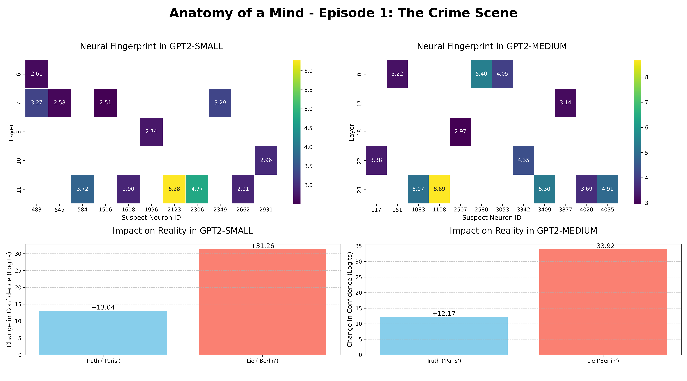
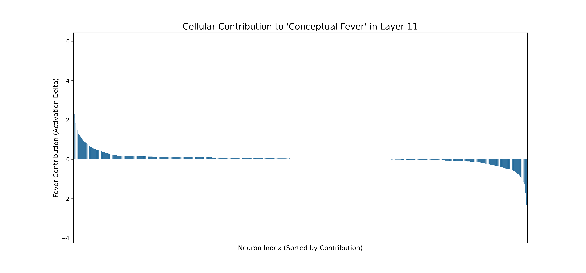

# Anatomy of a Falsehood: A Mechanistic Investigation of the Neural Correlates of Hallucinations in LLMs

**Author:** Öztürk Toker  
**Status:** Submitted to arXiv (Awaiting endorsement)

## Abstract

The opaque nature of Large Language Models (LLMs) poses a significant barrier to understanding and mitigating their tendency to generate factually incorrect information, a phenomenon known as "hallucination." This paper presents a comprehensive methodology to anatomically dissect the internal mechanisms of a controlled falsehood. We provide a new, mechanistic framework for understanding hallucinations not as stochastic errors, but as a traceable, structural, and dynamic conflict within the neural network.

[Read the Full Paper (PDF)](./main.pdf)

---

## Key Findings

This study presents a three-stage forensic investigation into the anatomy of a falsehood.

### 1. Evidence 1: The Neural Fingerprint & Conceptual Hyper-Excitation

A controlled falsehood leaves a consistent and scalable **"neural fingerprint"** in the network. This not only identifies the lie but also induces a state of **"conceptual hyper-excitation,"** pathologically increasing the model's confidence in both correct and incorrect related concepts.

*Figure 1: The neural fingerprint in GPT-2 Small and Medium, showing anomalous neuron activations and the resulting hyper-excitation.*

### 2. Evidence 2: The Structuralist Hallucination Theory

Interrogation of the "culprit" neurons reveals they are not semantically confused. Instead, they are **"amoral" structural engineers** concerned only with syntactic validity. This supports our **"Structuralist Hallucination Theory"**: hallucinations can be endorsed by neurons that care about grammar, not truth.

### 3. Evidence 3: The Contagion Pathway & Neural Conflict

A falsehood spreads through the network like a contagion, amplifying exponentially across layers. At its epicenter, a **"neural conflict"** occurs between a minority of **"amplifier"** neurons promoting the lie and a group of **"suppressor"** neurons attempting to inhibit it.

*Figure 2: The measurable struggle between amplifier (positive contribution) and suppressor (negative contribution) neurons in a late layer.*

---

## License

This project is licensed under the [Creative Commons Attribution-NonCommercial-ShareAlike 4.0 International License](LICENSE).

[![CC BY-NC-SA 4.0][cc-by-nc-sa-shield]][cc-by-nc-sa]

[cc-by-nc-sa]: http://creativecommons.org/licenses/by-nc-sa/4.0/
[cc-by-nc-sa-shield]: https://img.shields.io/badge/License-CC%20BY--NC--SA%204.0-lightgrey.svg

---

## References & Further Reading

This work builds upon and is in dialogue with the foundational research in the field of mechanistic interpretability. Key works that have informed our approach include:

1.  Vaswani, A., et al. (2017). Attention is all you need. In *Advances in Neural Information Processing Systems*.
2.  Radford, A., et al. (2019). Language models are unsupervised multitask learners. *OpenAI*.
3.  Elhage, N., Nanda, N., et al. (2021). A mathematical framework for transformer circuits. *Transformer Circuits Pub*.
4.  Olah, C., et al. (2020). Zoom in: An introduction to circuits. *Distill*.
5.  Meng, K., et al. (2022). Locating and editing factual associations in GPT. In *Advances in Neural Information Processing Systems*.
6.  Ji, Z., et al. (2023). Survey of hallucination in natural language generation. *ACM Computing Surveys*.
7.  Nanda, N. (2022). TransformerLens. *GitHub*.
